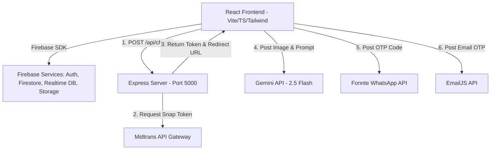

# 📘 Deskripsi Perancangan Perangkat Lunak (DPPL)
## Proyek: Salin Gaya (Premium Thrifting E-Commerce Platform)

---

## 1. Perancangan Arsitektur

### 1.1 Arsitektur Sistem Global
Platform **Salin Gaya** dirancang menggunakan arsitektur **Hybrid Client-Server** dengan mengombinasikan layanan *Backend-as-a-Service* (BaaS) dari Firebase dan Middleware Server berbasis Node.js/Express:

1.  **Client Application (Frontend):** Aplikasi Single Page Application (SPA) berbasis **React 18** yang dikembangkan dengan **Vite** dan **TypeScript**. Komponen antarmuka menggunakan pustaka **shadcn-ui** (Radix UI) yang distyle menggunakan **Tailwind CSS**.
2.  **Serverless Cloud (Firebase BaaS):** Menggunakan Firebase SDK untuk memproses Autentikasi (`auth`), Database Transaksional (`dbFirestore`), Real-time Sync Database (`db`), dan Penyimpanan Aset Foto (`storage`) secara langsung dari sisi Client tanpa perantara API buatan sendiri.
3.  **Middleware Payment Server:** Server mandiri berbasis **Express.js** untuk menangani otentikasi kunci rahasia (*server key*) Midtrans guna menghasilkan Snap Token pembayaran.



---

## 2. Perancangan Database (Skema Data)

Sistem menggunakan gabungan dua jenis basis data dari Firebase: **Cloud Firestore** (berbasis dokumen relasional/transaksional) dan **Realtime Database** (berbasis JSON tree untuk data real-time berlatensi rendah).

### 2.1 Skema Cloud Firestore
Firestore menyimpan data berorientasi dokumen terstruktur yang membutuhkan tingkat konsistensi dan aturan keamanan tinggi.

#### A. Koleksi `users`
Menyimpan profil pengguna platform.
*   **Path:** `/users/{userId}`
*   **Struktur Data:**
    ```json
    {
      "uid": "String (PK)",
      "name": "String",
      "email": "String",
      "phone": "String",
      "role": "String (enum: 'buyer', 'seller', 'admin')",
      "address": {
        "street": "String",
        "city": "String",
        "postalCode": "String",
        "latitude": "Number",
        "longitude": "Number"
      },
      "createdAt": "Timestamp"
    }
    ```

#### B. Koleksi `carts`
Menyimpan item belanja aktif milik pengguna.
*   **Path:** `/carts/{cartId}` (di mana `cartId` sama dengan `userId` pembeli)
*   **Struktur Data:**
    ```json
    {
      "items": [
        {
          "productId": "String",
          "name": "String",
          "price": "Number",
          "quantity": "Number",
          "image": "String"
        }
      ]
    }
    ```

#### C. Koleksi `orders`
Menyimpan transaksi pembelian pakaian.
*   **Path:** `/orders/{orderId}`
*   **Struktur Data:**
    ```json
    {
      "orderId": "String (PK)",
      "buyerUid": "String (FK)",
      "sellerUid": "String (FK)",
      "items": [
        {
          "productId": "String",
          "name": "String",
          "price": "Number",
          "image": "String"
        }
      ],
      "totalAmount": "Number",
      "paymentMethod": "String (enum: 'qris', 'midtrans')",
      "paymentStatus": "String (enum: 'pending', 'approved', 'rejected', 'settled')",
      "shippingStatus": "String (enum: 'pending', 'shipped', 'delivered')",
      "receiptNumber": "String (optional)",
      "qrisProofUrl": "String (optional)",
      "createdAt": "Timestamp"
    }
    ```

#### D. Koleksi `chats`
Menyimpan daftar ruang obrolan (chat room).
*   **Path:** `/chats/{chatId}`
*   **Struktur Data:**
    ```json
    {
      "chatId": "String (PK)",
      "participants": ["String (UserUID)"],
      "lastMessage": "String",
      "lastMessageTime": "Timestamp"
    }
    ```
*   **Subkoleksi `/chats/{chatId}/messages/{messageId}`:**
    ```json
    {
      "messageId": "String (PK)",
      "senderId": "String (FK)",
      "text": "String",
      "timestamp": "Timestamp",
      "isRead": "Boolean"
    }
    ```

---

### 2.2 Skema Firebase Realtime Database
Realtime Database digunakan untuk memperbarui status real-time dengan latensi sangat rendah.

#### A. Node `products`
*   **Path:** `/products/{productId}`
*   **Struktur Data:**
    ```json
    {
      "productId": "String (PK)",
      "sellerUid": "String",
      "name": "String",
      "description": "String",
      "price": "Number",
      "images": ["String (URL)"],
      "grade": "String (enum: 'A', 'B', 'C')",
      "style": "String",
      "condition": "String",
      "size": "String",
      "status": "String (enum: 'available', 'sold')",
      "createdAt": "Number (Timestamp Epoch)"
    }
    ```

#### B. Node `status` (Presensi Pengguna)
*   **Path:** `/status/{userId}`
*   **Struktur Data:**
    ```json
    {
      "state": "String (enum: 'online', 'offline')",
      "lastChanged": "Number (Timestamp Epoch)"
    }
    ```

#### C. Node `typing` (Indikator Mengetik Chat)
*   **Path:** `/typing/{chatId}/{userId}`
*   **Struktur Data:**
    ```json
    {
      "isTyping": "Boolean"
    }
    ```

---

## 3. Alur Kerja & Interaksi (Sequence Design)

### 3.1 Alur Unggah Produk & AI Quality Control
Proses pengunggahan pakaian oleh Penjual dilengkapi kurasi AI vision:
1.  Penjual memilih gambar produk di form upload.
2.  Script frontend mengompresi gambar untuk mengurangi ukuran transmisi.
3.  Frontend mengirim gambar tersebut ke **Gemini Vision API (gemini-2.5-flash)** dengan menyertakan instruksi validasi (*Strict Rules*):
    *   Harus foto fisik baju asli, bukan gambar dummy/katalog.
    *   Harus termasuk kategori pakaian/fashion.
    *   Kondisi kain tidak boleh hancur atau robek parah.
4.  Gemini API mengembalikan respons JSON:
    *   `approved` (boolean): `true` jika lolos semua aturan di atas.
    *   `grade` (string): kualitas barang (`A`/`B`/`C`/`DITOLAK`).
    *   `suggestedName` & `suggestedDescription`: saran teks pemasaran.
    *   `style`: kategori fashion (vintage, streetwear, casual, dll).
5.  Jika `approved = false` (ditolak), sistem menampilkan pesan kesalahan dari Gemini dan membatalkan proses upload.
6.  Jika `approved = true`, sistem mengisi kolom form secara otomatis. Penjual meninjau input, memasukkan harga, lalu mengklik "Publish".
7.  Sistem mengunggah gambar produk ke **Firebase Storage**, mengambil URL-nya, lalu menulis data produk tersebut ke node `/products` di **Realtime Database**.

### 3.2 Alur Transaksi & Pembayaran Midtrans
1.  Pembeli melakukan checkout produk di halaman `/checkout`.
2.  Frontend mengirim request POST ke server middleware `/api/charge` dengan membawa payload (orderId, grossAmount, customerDetails, itemDetails).
3.  Express Server menggunakan `midtrans-client` (Snap API) dengan menyertakan Server Key rahasia untuk meminta token pembayaran.
4.  Server Midtrans mengembalikan `token` dan `redirect_url`.
5.  Express Server meneruskan `token` dan `redirect_url` ke frontend.
6.  Frontend memicu modul Midtrans Snap popup di browser pembeli. Pembeli menyelesaikan pembayaran di popup tersebut.
7.  Sistem mengupdate data pesanan di Firestore `/orders/{orderId}` menjadi status `settled` (terbayar).
